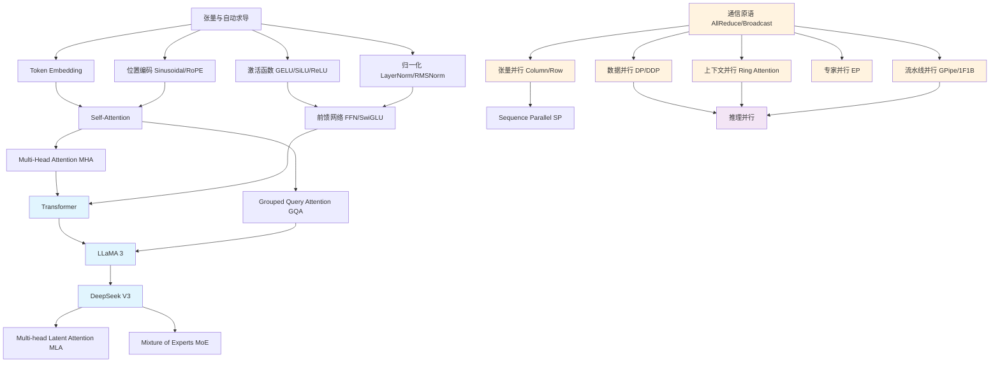

# 入门指南

## 项目简介

LLM Parallel 是一个 LLM 架构与分布式并行的学习项目。通过手写实现核心组件，从零构建对 LLM 技术栈的系统性认知。

本项目适合以下读者：
- 有一定 Python 基础，想理解 LLM 底层原理的开发者
- 熟悉 PyTorch 基本用法，想深入了解分布式训练的工程师
- 对 Transformer、LLaMA、DeepSeek 等模型架构感兴趣的初学者

## 环境搭建

### 1. 克隆仓库

```bash
git clone <repo-url>
cd llm_parallel
```

### 2. 创建虚拟环境

```bash
python -m venv .venv
source .venv/bin/activate  # Linux/Mac
# 或 .venv\Scripts\activate  # Windows
```

### 3. 安装依赖

```bash
# CPU 版本
pip install -r requirements.txt

# 如需 GPU 加速，先安装对应 CUDA 版本的 PyTorch
# 参考 https://pytorch.org/get-started/locally/
pip install torch>=2.0.0 --index-url https://download.pytorch.org/whl/cu124
pip install -r requirements-cuda.txt
```

### 4. 验证环境

```bash
python -c "import torch; print('PyTorch:', torch.__version__); print('CUDA:', torch.cuda.is_available())"
pytest tests/ -v
```

## 项目结构

```
llm_parallel/
├── models/                  # 模型架构实现
│   ├── common/              # 通用组件：激活函数、注意力、归一化、位置编码、FFN、Embedding
│   ├── transformer/         # 原始 Transformer（Encoder-Decoder）
│   ├── llama3/              # LLaMA 3（Decoder-only, GQA, RoPE, SwiGLU, KV Cache）
│   └── deepseek_v3/         # DeepSeek V3（MLA 低秩压缩注意力 + MoE 混合专家）
├── parallel/                # 分布式并行实现
│   ├── communication/       # 集合通信原语：AllReduce, AllGather, Broadcast
│   ├── data_parallel/       # 数据并行：DP, DDP, 梯度累积
│   ├── tensor_parallel/     # 张量并行：Column/Row/Embedding Parallel, Sequence Parallel
│   ├── pipeline_parallel/   # 流水线并行：GPipe, 1F1B
│   ├── expert_parallel/     # 专家并行：Expert Partition, Token Dispatch
│   ├── context_parallel/    # 上下文并行：Ring Attention, 序列切分
│   ├── inference/           # 推理优化：KV Cache 分片, Prefill/Decode, Speculative Decoding
│   └── utils/               # 工具：通信模拟器, 张量分片, 可视化
├── notebooks/               # 10 个 Jupyter 交互式教程
├── tests/                   # pytest 测试用例
├── docs/                    # 详细文档（你正在读的这里）
├── requirements.txt         # CPU 依赖
└── requirements-cuda.txt    # CUDA 依赖
```

## 知识依赖图谱

以下是项目中核心概念之间的依赖关系。箭头表示"学习 A 之前需要先理解 B"。



## 学习路径

### 路线一：模型架构（建议 1-2 周）

从经典 Transformer 到现代 LLM，理解架构演进的核心思路：

| 步骤 | 主题 | 文档 | 动手 |
|------|------|------|------|
| 1 | Attention 基础 | [models/overview.md](models/overview.md) | [notebook 01](../notebooks/01_attention_basics.ipynb) |
| 2 | Transformer | [models/overview.md](models/overview.md) | [notebook 02](../notebooks/02_transformer_walkthrough.ipynb) |
| 3 | LLaMA 3 | [models/overview.md](models/overview.md) | [notebook 03](../notebooks/03_llama3_walkthrough.ipynb) |
| 4 | DeepSeek V3 | [models/overview.md](models/overview.md) | [notebook 04](../notebooks/04_deepseek_v3_walkthrough.ipynb) |

### 路线二：分布式并行（建议 2-3 周）

前置要求：路线一至少完成前两步（理解 Attention 和 Transformer 基本结构）

| 步骤 | 主题 | 文档 | 动手 |
|------|------|------|------|
| 1 | 通信原语 | [parallel/overview.md](parallel/overview.md) | [notebook 05](../notebooks/05_communication_primitives.ipynb) |
| 2 | 数据并行 | [parallel/overview.md](parallel/overview.md) | [notebook 06](../notebooks/06_data_parallel.ipynb) |
| 3 | 张量并行 | [parallel/overview.md](parallel/overview.md) | [notebook 07](../notebooks/07_tensor_parallel.ipynb) |
| 4 | 流水线并行 | [parallel/overview.md](parallel/overview.md) | [notebook 08](../notebooks/08_pipeline_parallel.ipynb) |
| 5 | 专家 & 上下文并行 | [parallel/overview.md](parallel/overview.md) | [notebook 09](../notebooks/09_expert_and_context_parallel.ipynb) |
| 6 | 推理并行 | [parallel/overview.md](parallel/overview.md) | [notebook 10](../notebooks/10_inference_parallel.ipynb) |

## 学习方法建议

每个主题推荐的学习流程：

1. **读文档** — 先看 docs/ 中的原理讲解，建立概念框架
2. **看代码结构** — 浏览模块 README，了解文件组织和关键类
3. **跑 Notebook** — 执行对应 notebook，观察输入输出和张量形状变化
4. **读源码** — 带着 notebook 中的疑问阅读源码实现
5. **跑测试** — 运行 `pytest tests/` 验证你的理解是否正确

> **提示：** 本项目所有模型配置都使用小规模参数（dim=128, n_layers=2-4），可以在消费级 GPU（8-12GB）甚至 CPU 上运行。
