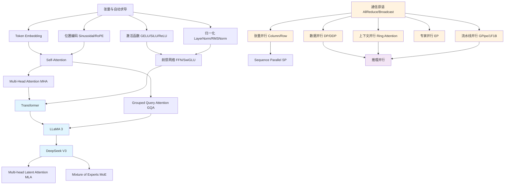

# Learning Documentation System Implementation Plan

> **For agentic workers:** REQUIRED SUB-SKILL: Use superpowers:subagent-driven-development (recommended) or superpowers:executing-plans to implement this plan task-by-task. Steps use checkbox (`- [ ]`) syntax for tracking.

**Goal:** Create a systematic documentation layer for the LLM parallel learning project, enabling Python/PyTorch beginners to understand core concepts without reading code first.

**Architecture:** Mixed approach — `docs/` holds principle-based explanations and learning paths, module-level `README.md` files provide navigation and quick-start guides, with cross-links between them. Chinese-English mixed language (technical terms in English, explanations in Chinese).

**Tech Stack:** Markdown, Mermaid diagrams (for knowledge dependency graph in getting-started.md)

---

## File Structure

All files are new (create only, no modifications to existing files):

```
docs/
├── getting-started.md                    # Task 1
├── faq.md                                # Task 2
├── models/
│   └── overview.md                       # Task 3
└── parallel/
    └── overview.md                       # Task 4

models/
├── common/README.md                      # Task 5
├── transformer/README.md                 # Task 6
├── llama3/README.md                      # Task 7
└── deepseek_v3/README.md                 # Task 8

parallel/
├── communication/README.md               # Task 9
├── data_parallel/README.md               # Task 10
├── tensor_parallel/README.md             # Task 11
├── pipeline_parallel/README.md           # Task 12
├── expert_parallel/README.md             # Task 13
├── context_parallel/README.md            # Task 14
├── inference/README.md                   # Task 15
└── utils/README.md                       # Task 16
```

---

## Task 1: Create `docs/getting-started.md`

**Files:**
- Create: `docs/getting-started.md`

- [ ] **Step 1: Create the file with full content**

This is the main entry point for the project. It contains: project introduction, environment setup (mirroring README quick start), directory structure overview, learning paths with knowledge dependency graph, and the recommended study pattern.

```markdown
# 入门指南

## 项目简介

LLM Parallel 是一个 LLM 架构与分布式并行的学习项目。通过手写实现核心组件，从零构建对 LLM 技术栈的系统性认知。

本项目适合以下读者：
- 有一定 Python 基础，想理解 LLM 底层原理的开发者
- 熟悉 PyTorch 基本用法，想深入了解分布式训练的工程师
- 对 Transformer、LLaMA、DeepSeek 等模型架构感兴趣的初学者

## 环境搭建

### 1. 克隆仓库

```bash
git clone <repo-url>
cd llm_parallel
```

### 2. 创建虚拟环境

```bash
python -m venv .venv
source .venv/bin/activate  # Linux/Mac
# 或 .venv\Scripts\activate  # Windows
```

### 3. 安装依赖

```bash
# CPU 版本
pip install -r requirements.txt

# 如需 GPU 加速，先安装对应 CUDA 版本的 PyTorch
# 参考 https://pytorch.org/get-started/locally/
pip install torch>=2.0.0 --index-url https://download.pytorch.org/whl/cu124
pip install -r requirements-cuda.txt
```

### 4. 验证环境

```bash
python -c "import torch; print('PyTorch:', torch.__version__); print('CUDA:', torch.cuda.is_available())"
pytest tests/ -v
```

## 项目结构

```
llm_parallel/
├── models/                  # 模型架构实现
│   ├── common/              # 通用组件：激活函数、注意力、归一化、位置编码、FFN、Embedding
│   ├── transformer/         # 原始 Transformer（Encoder-Decoder）
│   ├── llama3/              # LLaMA 3（Decoder-only, GQA, RoPE, SwiGLU, KV Cache）
│   └── deepseek_v3/         # DeepSeek V3（MLA 低秩压缩注意力 + MoE 混合专家）
├── parallel/                # 分布式并行实现
│   ├── communication/       # 集合通信原语：AllReduce, AllGather, Broadcast
│   ├── data_parallel/       # 数据并行：DP, DDP, 梯度累积
│   ├── tensor_parallel/     # 张量并行：Column/Row/Embedding Parallel, Sequence Parallel
│   ├── pipeline_parallel/   # 流水线并行：GPipe, 1F1B
│   ├── expert_parallel/     # 专家并行：Expert Partition, Token Dispatch
│   ├── context_parallel/    # 上下文并行：Ring Attention, 序列切分
│   ├── inference/           # 推理优化：KV Cache 分片, Prefill/Decode, Speculative Decoding
│   └── utils/               # 工具：通信模拟器, 张量分片, 可视化
├── notebooks/               # 10 个 Jupyter 交互式教程
├── tests/                   # pytest 测试用例
├── docs/                    # 详细文档（你正在读的这里）
├── requirements.txt         # CPU 依赖
└── requirements-cuda.txt    # CUDA 依赖
```

## 知识依赖图谱

以下是项目中核心概念之间的依赖关系。箭头表示"学习 A 之前需要先理解 B"。



## 学习路径

### 路线一：模型架构（建议 1-2 周）

从经典 Transformer 到现代 LLM，理解架构演进的核心思路：

| 步骤 | 主题 | 文档 | 动手 |
|------|------|------|------|
| 1 | Attention 基础 | [models/overview.md](models/overview.md) | [notebook 01](../notebooks/01_attention_basics.ipynb) |
| 2 | Transformer | [models/overview.md](models/overview.md) | [notebook 02](../notebooks/02_transformer_walkthrough.ipynb) |
| 3 | LLaMA 3 | [models/overview.md](models/overview.md) | [notebook 03](../notebooks/03_llama3_walkthrough.ipynb) |
| 4 | DeepSeek V3 | [models/overview.md](models/overview.md) | [notebook 04](../notebooks/04_deepseek_v3_walkthrough.ipynb) |

### 路线二：分布式并行（建议 2-3 周）

前置要求：路线一至少完成前两步（理解 Attention 和 Transformer 基本结构）

| 步骤 | 主题 | 文档 | 动手 |
|------|------|------|------|
| 1 | 通信原语 | [parallel/overview.md](parallel/overview.md) | [notebook 05](../notebooks/05_communication_primitives.ipynb) |
| 2 | 数据并行 | [parallel/overview.md](parallel/overview.md) | [notebook 06](../notebooks/06_data_parallel.ipynb) |
| 3 | 张量并行 | [parallel/overview.md](parallel/overview.md) | [notebook 07](../notebooks/07_tensor_parallel.ipynb) |
| 4 | 流水线并行 | [parallel/overview.md](parallel/overview.md) | [notebook 08](../notebooks/08_pipeline_parallel.ipynb) |
| 5 | 专家 & 上下文并行 | [parallel/overview.md](parallel/overview.md) | [notebook 09](../notebooks/09_expert_and_context_parallel.ipynb) |
| 6 | 推理并行 | [parallel/overview.md](parallel/overview.md) | [notebook 10](../notebooks/10_inference_parallel.ipynb) |

## 学习方法建议

每个主题推荐的学习流程：

1. **读文档** — 先看 docs/ 中的原理讲解，建立概念框架
2. **看代码结构** — 浏览模块 README，了解文件组织和关键类
3. **跑 Notebook** — 执行对应 notebook，观察输入输出和张量形状变化
4. **读源码** — 带着 notebook 中的疑问阅读源码实现
5. **跑测试** — 运行 `pytest tests/` 验证你的理解是否正确

> **提示：** 本项目所有模型配置都使用小规模参数（dim=128, n_layers=2-4），可以在消费级 GPU（8-12GB）甚至 CPU 上运行。
```

- [ ] **Step 2: Verify file is created and well-formed**

Run: `ls docs/getting-started.md && wc -l docs/getting-started.md`
Expected: File exists, approximately 150-180 lines

- [ ] **Step 3: Verify Mermaid diagram syntax**

Open the file in a Mermaid-compatible viewer (VS Code preview, GitHub) and confirm the dependency graph renders correctly.

- [ ] **Step 4: Commit**

```bash
git add docs/getting-started.md
git commit -m "docs: add getting-started guide with learning paths and knowledge dependency graph"
```

---

## Task 2: Create `docs/faq.md`

**Files:**
- Create: `docs/faq.md`

- [ ] **Step 1: Create the file with full content**

Common questions beginners encounter when learning LLM architecture and distributed parallelism.

```markdown
# 常见问题

## 环境与运行

### Q: 运行 notebook 报 `ModuleNotFoundError: No module named 'models'`

**A:** 需要在项目根目录下启动 Jupyter，或者将项目根目录加入 Python 路径：

```bash
cd llm_parallel
jupyter notebook
```

或在 notebook 开头添加：

```python
import sys
sys.path.insert(0, '..')  # 如果 notebook 在 notebooks/ 目录下
```

### Q: CUDA 相关报错怎么办？

**A:** 本项目默认支持 CPU 运行。如需 GPU：
1. 确认 `nvidia-smi` 能正常输出
2. 安装对应 CUDA 版本的 PyTorch（参考 PyTorch 官网）
3. 验证：`python -c "import torch; print(torch.cuda.is_available())"` 应输出 `True`

### Q: 测试跑不过？

**A:** 确保依赖已正确安装：`pip install -r requirements.txt`。通信相关测试需要多进程支持，在 Windows 上可能有兼容性问题，建议在 Linux/Mac 上运行。

## 模型架构

### Q: Transformer 的 Encoder 和 Decoder 有什么区别？

**A:** Encoder 处理完整输入序列（双向 Self-Attention），Decoder 逐步生成输出序列（Masked Self-Attention + Cross-Attention）。现代 LLM（如 LLaMA）只用 Decoder 部分，称为 Decoder-only 架构。

### Q: GQA 和 MHA 的区别是什么？为什么 LLaMA 用 GQA？

**A:** MHA（Multi-Head Attention）每个头都有独立的 Q/K/V 权重。GQA（Grouped Query Attention）让多个 Q 头共享一组 K/V 头，减少了 KV Cache 的内存占用和计算量。LLaMA 3 用 GQA 在保持模型质量的同时降低推理成本。

### Q: RoPE 和 Sinusoidal Position Encoding 的区别？

**A:** Sinusoidal PE 将位置信息直接加到 token embedding 上。RoPE（Rotary Positional Embedding）通过对 Q/K 向量做旋转变换来编码位置，具有更好的外推性（能处理训练时没见过的更长序列），是现代 LLM 的标配。

### Q: DeepSeek V3 的 MLA 是怎么减少 KV Cache 的？

**A:** MLA（Multi-head Latent Attention）将 KV 压缩到一个低秩的 latent 空间。传统 MHA 需要缓存每个头的完整 K 和 V，MLA 只需要缓存压缩后的低维 latent 向量，大幅减少了显存占用。

### Q: MoE（混合专家）是怎么工作的？

**A:** MoE 用一个 Router（路由器）根据 token 内容决定将每个 token 发送给哪些 expert（专家网络）。每次只激活少数 expert，模型总参数量很大但每次前向传播只用一小部分，实现了"大模型能力、小模型计算量"。

## 分布式并行

### Q: 数据并行和张量并行的区别？

**A:** 数据并行（DP）将数据切分到不同 GPU，每个 GPU 有完整模型副本，同步梯度。张量并行（TP）将模型权重切分到不同 GPU，每个 GPU 只计算模型的一部分。DP 适合单机多卡，TP 适合单层计算量大的场景。

### Q: AllReduce 的通信量是怎么计算的？

**A:** Ring AllReduce 的通信量为 `2 * (P-1) / P * data_size`，接近 `2 * data_size`，与 GPU 数量 P 基本无关。这是 Ring 拓扑的优势——带宽最优。

### Q: 流水线并行的 Bubble 是什么？

**A:** 在 GPipe 中，由于需要等待所有 micro-batch 完成前向传播才能开始反向传播，部分 GPU 会处于空闲等待状态，这种空闲时间称为 Bubble。1F1B 调度策略通过交替执行前向和反向来减小 Bubble。

### Q: 为什么需要 Sequence Parallel？

**A:** 标准张量并行中，LayerNorm 和 Dropout 的激活值在每个 GPU 上都是完整副本（沿 sequence 维度不切分）。Sequence Parallel 将这些操作的激活值也沿序列维度切分，减少了激活值的显存占用。
```

- [ ] **Step 2: Verify file is created**

Run: `ls docs/faq.md && wc -l docs/faq.md`
Expected: File exists, approximately 90-110 lines

- [ ] **Step 3: Commit**

```bash
git add docs/faq.md
git commit -m "docs: add FAQ covering environment, model architecture, and parallelism questions"
```

---

## Task 3: Create `docs/models/overview.md`

**Files:**
- Create: `docs/models/overview.md`

- [ ] **Step 1: Create the file with full content**

Overview of the three model architectures, their evolution, and key innovations.

```markdown
# 模型架构总览

本项目实现了三个代表性的 LLM 架构，展示了从经典到现代的演进过程：

```
Transformer (2017)  →  LLaMA 3 (2024)  →  DeepSeek V3 (2024)
  Encoder-Decoder       Decoder-only        Decoder-only + MoE
  MHA + FFN             GQA + SwiGLU        MLA + MoE + SwiGLU
  Sinusoidal PE         RoPE                RoPE (decoupled)
  LayerNorm             RMSNorm             RMSNorm
```

## 三者核心对比

| 特性 | Transformer | LLaMA 3 | DeepSeek V3 |
|------|-------------|---------|-------------|
| 架构类型 | Encoder-Decoder | Decoder-only | Decoder-only |
| 注意力机制 | MHA | GQA | MLA（低秩压缩） |
| 位置编码 | Sinusoidal | RoPE | RoPE（解耦） |
| 归一化 | LayerNorm (Post-Norm) | RMSNorm (Pre-Norm) | RMSNorm (Pre-Norm) |
| FFN | GELU-FFN | SwiGLU-FFN | SwiGLU-FFN + MoE |
| KV Cache | 无 | 有 | 有（低秩压缩版） |
| 主要用途 | 序列到序列任务 | 通用文本生成 | 高效大规模推理 |

## 演进脉络

### 从 Transformer 到 LLaMA 3

LLaMA 3 做了以下关键改进：
- **Decoder-only**：去掉 Encoder，只保留 Decoder，更适合自回归生成任务
- **RMSNorm 替换 LayerNorm**：计算更简单（不需要计算均值），效果相当
- **RoPE 替换 Sinusoidal PE**：更好的长序列外推能力
- **SwiGLU 替换 GELU**：门控机制提升 FFN 的表达能力
- **GQA 替换 MHA**：减少 KV Cache，提升推理效率
- **Pre-Norm 替换 Post-Norm**：训练更稳定

### 从 LLaMA 3 到 DeepSeek V3

DeepSeek V3 在 LLaMA 基础上引入了两个重大创新：
- **MLA（Multi-head Latent Attention）**：将 KV 压缩到低秩空间，KV Cache 减少到原来的 5-13%
- **MoE（Mixture of Experts）**：671B 总参数量，但每次只激活 37B，实现大模型能力与推理效率的平衡

## 学习建议

建议按 Transformer → LLaMA 3 → DeepSeek V3 的顺序学习，每个模型都在前一个的基础上做了改进，理解改进的原因比记住实现细节更重要。

- [Transformer 模块](../models/transformer/README.md) → [notebook 02](../../notebooks/02_transformer_walkthrough.ipynb)
- [LLaMA 3 模块](../models/llama3/README.md) → [notebook 03](../../notebooks/03_llama3_walkthrough.ipynb)
- [DeepSeek V3 模块](../models/deepseek_v3/README.md) → [notebook 04](../../notebooks/04_deepseek_v3_walkthrough.ipynb)
```

- [ ] **Step 2: Verify file is created**

Run: `ls docs/models/overview.md && wc -l docs/models/overview.md`
Expected: File exists, approximately 70-90 lines

- [ ] **Step 3: Commit**

```bash
git add docs/models/overview.md
git commit -m "docs: add model architecture overview with evolution comparison"
```

---

## Task 4: Create `docs/parallel/overview.md`

**Files:**
- Create: `docs/parallel/overview.md`

- [ ] **Step 1: Create the file with full content**

Overview of distributed parallelism strategies, classification system, and when to use each.

```markdown
# 并行策略总览

分布式并行是训练和推理大模型的核心技术。本项目实现了六大并行策略，覆盖从训练到推理的完整场景。

## 并行策略分类

```
分布式并行策略
├── 训练并行
│   ├── 数据并行 (Data Parallel)    — 切分数据，每卡完整模型
│   ├── 张量并行 (Tensor Parallel)  — 切分单层权重
│   ├── 流水线并行 (Pipeline Parallel) — 切分模型层
│   └── 专家并行 (Expert Parallel)  — 切分 MoE 专家
├── 序列并行
│   └── 上下文并行 (Context Parallel) — 切分长序列
└── 推理优化
    ├── KV Cache 分片
    ├── Prefill/Decode 分离
    └── Speculative Decoding
```

## 各策略对比

| 策略 | 切分对象 | 通信操作 | 适用场景 | 通信量 |
|------|---------|---------|---------|--------|
| 数据并行 | 数据 (Batch) | AllReduce (梯度) | 通用训练 | O(模型参数) |
| 张量并行 | 模型权重 (层内) | AllReduce / AllGather | 单层大、多机互联快 | O(激活值) |
| 流水线并行 | 模型层 (层间) | Send/Recv | 模型层数多 | O(激活值) |
| 专家并行 | MoE 专家 | All-to-All | MoE 模型 | O(token 数) |
| 上下文并行 | 序列长度 | AllGather / Ring | 超长序列 | O(序列长度) |

## 通信基础

所有并行策略都依赖集合通信原语。学习并行之前，务必先理解：

| 原语 | 含义 | 用途 |
|------|------|------|
| Broadcast | 一个 rank 的数据广播到所有 rank | 模型初始化同步 |
| AllReduce | 所有 rank 的数据做归约，结果广播 | 梯度同步 |
| AllGather | 收集所有 rank 的数据拼接 | 张量并行输出收集 |
| ReduceScatter | 归约后分散到各 rank | 张量并行梯度处理 |
| All-to-All | 全交换 | 专家并行 token 分发 |

详细实现：[parallel/communication/README.md](../parallel/communication/README.md)

## 适用场景速查

- **单机多卡，模型放得下** → 数据并行（最简单）
- **单层计算量太大** → 张量并行
- **模型太深，层数太多** → 流水线并行
- **MoE 模型** → 专家并行
- **超长序列（>128K）** → 上下文并行
- **推理显存不够** → KV Cache 分片 + Speculative Decoding
- **多策略组合** → 常见组合如 DP+TP、DP+TP+PP

## 通信拓扑的影响

并行策略的效率高度依赖硬件互联拓扑：

| 拓扑 | 特点 | 适合的策略 |
|------|------|-----------|
| Ring | 带宽最优，延迟与节点数成正比 | 数据并行 |
| Tree | 延迟最优，带宽有瓶颈 | Broadcast |
| Mesh (NVLink/NVSwitch) | 高带宽低延迟 | 张量并行 |

详细分析：[parallel/communication/README.md](../parallel/communication/README.md)

## 学习建议

建议按以下顺序学习，每一步都建立在前一步的基础上：

1. [通信原语](../parallel/communication/README.md) → [notebook 05](../../notebooks/05_communication_primitives.ipynb)
2. [数据并行](../parallel/data_parallel/README.md) → [notebook 06](../../notebooks/06_data_parallel.ipynb)
3. [张量并行](../parallel/tensor_parallel/README.md) → [notebook 07](../../notebooks/07_tensor_parallel.ipynb)
4. [流水线并行](../parallel/pipeline_parallel/README.md) → [notebook 08](../../notebooks/08_pipeline_parallel.ipynb)
5. [专家 & 上下文并行](../parallel/expert_parallel/README.md) → [notebook 09](../../notebooks/09_expert_and_context_parallel.ipynb)
6. [推理并行](../parallel/inference/README.md) → [notebook 10](../../notebooks/10_inference_parallel.ipynb)
```

- [ ] **Step 2: Verify file is created**

Run: `ls docs/parallel/overview.md && wc -l docs/parallel/overview.md`
Expected: File exists, approximately 90-110 lines

- [ ] **Step 3: Commit**

```bash
git add docs/parallel/overview.md
git commit -m "docs: add parallelism overview with strategy comparison and scene guide"
```

---

## Task 5: Create `models/common/README.md`

**Files:**
- Create: `models/common/README.md`

- [ ] **Step 1: Create the file with full content**

```markdown
# 通用组件 (Common Components)

模型架构的共享基础组件，被 Transformer、LLaMA 3、DeepSeek V3 共同使用。

## 文件说明

| 文件 | 功能 | 关键内容 |
|------|------|---------|
| `activation.py` | 激活函数 | `gelu()`, `silu()`, `relu()` |
| `attention.py` | 注意力机制 | `MultiHeadAttention`, `GroupedQueryAttention` |
| `embeddings.py` | 词嵌入 | `TokenEmbedding` |
| `feedforward.py` | 前馈网络 | `FFN`, `SwiGLUFFN` |
| `normalization.py` | 归一化层 | `LayerNorm`, `RMSNorm` |
| `positional_encoding.py` | 位置编码 | `sinusoidal_pe()`, `RotaryPositionalEncoding` |

## 演进关系

```
Transformer 使用:  gelu, MultiHeadAttention, FFN, LayerNorm, sinusoidal_pe, TokenEmbedding
LLaMA 3 使用:     silu, GroupedQueryAttention, SwiGLUFFN, RMSNorm, RotaryPositionalEncoding, TokenEmbedding
DeepSeek V3 使用:  silu, SwiGLUFFN, RMSNorm, RotaryPositionalEncoding, TokenEmbedding
                   (+ 自有 MLA 和 MoE 实现)
```

## 详细文档

→ [模型架构总览](../../docs/models/overview.md)
```

- [ ] **Step 2: Verify and commit**

Run: `ls models/common/README.md`
Expected: File exists

```bash
git add models/common/README.md
git commit -m "docs: add models/common module README"
```

---

## Task 6: Create `models/transformer/README.md`

**Files:**
- Create: `models/transformer/README.md`

- [ ] **Step 1: Create the file with full content**

```markdown
# Transformer 模块

原始 Transformer 架构（Vaswani et al., 2017 "Attention Is All You Need"）。Encoder-Decoder 结构，适用于序列到序列任务如机器翻译。

## 文件说明

| 文件 | 功能 | 关键内容 |
|------|------|---------|
| `config.py` | 超参数配置 | `TransformerConfig` dataclass |
| `encoder.py` | Encoder 实现 | `EncoderLayer`, `Encoder` |
| `decoder.py` | Decoder 实现 | `DecoderLayer`, `Decoder` |
| `model.py` | 完整模型 | `Transformer` (Encoder-Decoder) |

## 架构要点

- **Post-Norm**: LayerNorm 在残差连接之后（原始论文的做法）
- **MHA**: 标准 Multi-Head Attention，每个头独立的 Q/K/V
- **Sinusoidal PE**: 固定的正弦位置编码
- **Cross-Attention**: Decoder 通过 Cross-Attention 关注 Encoder 输出

## 快速开始

```python
from models.transformer.config import TransformerConfig
from models.transformer.model import Transformer

config = TransformerConfig(vocab_size=1000, dim=128, n_heads=4, n_layers=2)
model = Transformer(config)

import torch
src = torch.randint(0, 1000, (2, 16))  # (batch=2, src_seq=16)
tgt = torch.randint(0, 1000, (2, 20))  # (batch=2, tgt_seq=20)
output = model(src, tgt)  # (2, 20, 1000) logits
```

## 详细文档

→ [模型架构总览](../../docs/models/overview.md)
→ [notebook 02: Transformer walkthrough](../../notebooks/02_transformer_walkthrough.ipynb)
```

- [ ] **Step 2: Verify and commit**

```bash
git add models/transformer/README.md
git commit -m "docs: add transformer module README"
```

---

## Task 7: Create `models/llama3/README.md`

**Files:**
- Create: `models/llama3/README.md`

- [ ] **Step 1: Create the file with full content**

```markdown
# LLaMA 3 模块

LLaMA 3 Decoder-only 架构，包含现代 LLM 的核心改进：GQA、RoPE、SwiGLU、RMSNorm、KV Cache。

## 文件说明

| 文件 | 功能 | 关键内容 |
|------|------|---------|
| `config.py` | 超参数配置 | `LLaMA3Config` (含 `n_kv_heads`, `rope_theta`) |
| `model.py` | 完整模型 | `TransformerBlock`, `LLaMA3Model`, `LLaMA3ForCausalLM` |

## 架构要点

- **Pre-Norm**: RMSNorm 在残差连接之前（训练更稳定）
- **GQA**: `n_kv_heads < n_heads`，多个 Q 头共享一组 K/V
- **RoPE**: 旋转位置编码，支持长序列外推
- **SwiGLU**: 三参数门控 FFN，`W1(x) * SiLU(W3(x))` 再过 `W2`
- **KV Cache**: 自回归生成时缓存已计算的 K/V，避免重复计算

## 快速开始

```python
from models.llama3.config import LLaMA3Config
from models.llama3.model import LLaMA3ForCausalLM

config = LLaMA3Config(vocab_size=1000, dim=128, n_heads=4, n_kv_heads=2, n_layers=4)
model = LLaMA3ForCausalLM(config)

import torch
input_ids = torch.randint(0, 1000, (1, 8))
output = model(input_ids)  # (1, 8, 1000) logits

# 自回归生成
generated = model.generate(input_ids, max_new_tokens=10)  # (1, 18)
```

## 详细文档

→ [模型架构总览](../../docs/models/overview.md)
→ [notebook 03: LLaMA 3 walkthrough](../../notebooks/03_llama3_walkthrough.ipynb)
```

- [ ] **Step 2: Verify and commit**

```bash
git add models/llama3/README.md
git commit -m "docs: add llama3 module README"
```

---

## Task 8: Create `models/deepseek_v3/README.md`

**Files:**
- Create: `models/deepseek_v3/README.md`

- [ ] **Step 1: Create the file with full content**

```markdown
# DeepSeek V3 模块

DeepSeek V3 Decoder-only 架构，两大核心创新：MLA（Multi-head Latent Attention）低秩压缩注意力和 MoE（Mixture of Experts）混合专家。

## 文件说明

| 文件 | 功能 | 关键内容 |
|------|------|---------|
| `config.py` | 超参数配置 | `DeepSeekV3Config` (含 MLA/MoE 参数) |
| `mla.py` | MLA 注意力 | `MultiHeadLatentAttention` — KV 低秩压缩 + 解耦 RoPE |
| `moe.py` | MoE 层 | `Router`, `SharedExpert`, `RoutedExpert`, `MoELayer` |
| `model.py` | 完整模型 | `DeepSeekV3Block`, `DeepSeekV3Model`, `DeepSeekV3ForCausalLM` |

## 架构要点

### MLA (Multi-head Latent Attention)
- 将 KV 投影到低秩 latent 空间：`c_kv = W_DKV * x`（压缩）→ `k, v = W_UK * c_kv, W_UV * c_kv`（解压）
- KV Cache 只需存储 `c_kv`，体积减少 5-13 倍
- RoPE 解耦：位置信息通过单独的 `q_pe, k_pe` 编码，不经过低秩压缩

### MoE (Mixture of Experts)
- **Router**: Top-K softmax 门控，决定每个 token 发给哪些 routed expert
- **SharedExpert**: 所有 token 都经过的 SwiGLU 专家（捕获通用知识）
- **RoutedExpert**: 由 Router 动态选择的 SwiGLU 专家（捕获专业领域知识）
- 总参数量大（671B），但每次前向只激活 37B 参数

## 快速开始

```python
from models.deepseek_v3.config import DeepSeekV3Config
from models.deepseek_v3.model import DeepSeekV3ForCausalLM

config = DeepSeekV3Config(
    vocab_size=1000, dim=128, n_heads=4, n_layers=4,
    n_routed_experts=8, n_shared_experts=1, n_activated_experts=2
)
model = DeepSeekV3ForCausalLM(config)

import torch
input_ids = torch.randint(0, 1000, (1, 8))
output = model(input_ids)  # (1, 8, 1000) logits
```

## 详细文档

→ [模型架构总览](../../docs/models/overview.md)
→ [notebook 04: DeepSeek V3 walkthrough](../../notebooks/04_deepseek_v3_walkthrough.ipynb)
```

- [ ] **Step 2: Verify and commit**

```bash
git add models/deepseek_v3/README.md
git commit -m "docs: add deepseek_v3 module README"
```

---

## Task 9: Create `parallel/communication/README.md`

**Files:**
- Create: `parallel/communication/README.md`

- [ ] **Step 1: Create the file with full content**

```markdown
# 通信原语模块

分布式训练的基础——集合通信原语。所有并行策略都建立在这些原语之上。

## 文件说明

| 文件 | 功能 | 关键内容 |
|------|------|---------|
| `primitives.py` | 通信原语手写实现 | `naive_all_reduce`, `ring_all_reduce`, `naive_all_gather`, `naive_broadcast`, `naive_reduce_scatter` |
| `setup.py` | 分布式环境管理 | `init_process_group`, `get_rank`, `get_world_size`, `cleanup` |
| `topologies.py` | 通信拓扑分析 | `analyze_ring_topology`, `analyze_tree_topology`, `analyze_mesh_topology`, `visualize_topology` |

## 核心概念

### 集合通信原语

| 原语 | 含义 | 复杂度 |
|------|------|--------|
| Broadcast | 一对多广播 | O(N) |
| AllReduce | 全局归约 + 广播 | Naive: O(N*P²), Ring: O(2N) |
| AllGather | 收集所有数据拼接 | O(N*(P-1)) |
| ReduceScatter | 归约后分散 | O(N*(P-1)) |

### Ring AllReduce

最经典的梯度同步算法，分两个阶段：
1. **Scatter-Reduce**: 数据沿 Ring 传递，每步做局部 reduce
2. **AllGather**: 归约结果沿 Ring 广播

总通信量 = `2 * (P-1)/P * N ≈ 2N`，与 GPU 数量基本无关。

## 快速开始

```python
from parallel.communication.primitives import naive_all_reduce, ring_all_reduce
from parallel.communication.topologies import analyze_ring_topology, visualize_topology

# 分析 Ring AllReduce 通信成本
cost = analyze_ring_topology(data_size_mb=100, num_gpus=8, bandwidth_gbps=25)
print(f"Ring AllReduce 时间: {cost['total_time_ms']:.2f} ms")

# 可视化拓扑
visualize_topology('ring', 4)
```

## 详细文档

→ [并行策略总览](../../docs/parallel/overview.md)
→ [notebook 05: 通信原语](../../notebooks/05_communication_primitives.ipynb)
```

- [ ] **Step 2: Verify and commit**

```bash
git add parallel/communication/README.md
git commit -m "docs: add communication module README"
```

---

## Task 10: Create `parallel/data_parallel/README.md`

**Files:**
- Create: `parallel/data_parallel/README.md`

- [ ] **Step 1: Create the file with full content**

```markdown
# 数据并行模块

最基础的并行策略：数据切分到多卡，每卡有完整模型副本，通过同步梯度保持一致。

## 文件说明

| 文件 | 功能 | 关键内容 |
|------|------|---------|
| `dp.py` | 原始数据并行 | `sync_gradients_naive` — 逐参数 AllReduce 梯度 |
| `ddp.py` | 分布式数据并行概念 | `broadcast_model`, `gradient_bucket_sync` — 梯度桶 + 计算通信重叠 |
| `gradient_accumulation.py` | 梯度累积 | `GradientAccumulator`, `compute_effective_batch_size` |

## 核心概念

### DP → DDP 的演进

```
DP (DataParallel):
  每个 step: Forward → AllReduce(grad) → Update
  问题: 梯度同步阻塞，GPU 空等

DDP (DistributedDataParallel):
  梯度桶: 将多个参数的梯度打包成桶，减少通信次数
  重叠: 反向传播时，后层梯度计算完立即同步，与前层计算重叠
```

### 梯度累积

将大 batch 拆成多个 micro-batch，累积多步梯度后再同步更新。效果等价于大 batch 训练，但显存占用按 micro-batch 计算。

有效 batch_size = micro_batch_size × accumulation_steps × world_size

## 快速开始

```python
from parallel.data_parallel.dp import sync_gradients_naive
from parallel.data_parallel.gradient_accumulation import compute_effective_batch_size

# 计算有效 batch size
eff_bs = compute_effective_batch_size(micro_batch=4, accumulation_steps=8, world_size=4)
print(f"有效 batch size: {eff_bs}")  # 128
```

## 详细文档

→ [并行策略总览](../../docs/parallel/overview.md)
→ [notebook 06: 数据并行](../../notebooks/06_data_parallel.ipynb)
```

- [ ] **Step 2: Verify and commit**

```bash
git add parallel/data_parallel/README.md
git commit -m "docs: add data_parallel module README"
```

---

## Task 11: Create `parallel/tensor_parallel/README.md`

**Files:**
- Create: `parallel/tensor_parallel/README.md`

- [ ] **Step 1: Create the file with full content**

```markdown
# 张量并行模块

将单层的权重矩阵切分到多个 GPU 上，每个 GPU 只计算一部分，通过集合通信拼接结果。

## 文件说明

| 文件 | 功能 | 关键内容 |
|------|------|---------|
| `column_parallel.py` | 列并行 Linear | `column_parallel_linear`, `split_weight_column` — 按输出维度切分权重 |
| `row_parallel.py` | 行并行 Linear | `row_parallel_linear`, `split_weight_row` — 按输入维度切分权重 |
| `embedding_parallel.py` | 并行 Embedding | `embedding_parallel_forward` — 词表切分到多卡 |
| `sequence_parallel.py` | 序列并行 | `scatter_along_seq`, `gather_along_seq`, `sp_transition_fwd` |
| `megatron_style.py` | Megatron 风格组合 | `megatron_transformer_block_fwd` — TP+SP 完整 Transformer Block |

## 核心概念

### Column Parallel vs Row Parallel

```
Column Parallel (Y = XW, 按列切 W):
  W = [W1 | W2 | ... | Wp]
  每个 GPU 计算 Yi = XWi
  最后 AllGather 拼接: Y = [Y1, Y2, ..., Yp]

Row Parallel (Y = XW, 按行切 W):
  W = [W1; W2; ...; Wp]  (纵向切)
  输入 X 对应切分: X = [X1, X2, ..., Xp]
  每个 GPU 计算 Yi = XiWi
  最后 AllReduce 求和: Y = ΣYi
```

### Sequence Parallel

在 TP 区域内，将 LayerNorm/Dropout 的激活值沿 sequence 维度切分，减少激活值显存占用。计算 Attention 时再 AllGather 拼回完整序列。

### Megatron 风格

将 Column Parallel + Row Parallel + Sequence Parallel 组合成完整的 Transformer Block：
```
Input → Scatter(seq) → LayerNorm → ColumnParallel(Attention) → AllGather → RowParallel → AllReduce → Residual
     → Scatter(seq) → LayerNorm → ColumnParallel(FFN) → AllGather → RowParallel → AllReduce → Residual
```

## 快速开始

```python
from parallel.tensor_parallel.column_parallel import column_parallel_linear, split_weight_column
from parallel.tensor_parallel.row_parallel import row_parallel_linear, split_weight_row
import torch

# 列并行示例（模拟 2 个 GPU）
full_weight = torch.randn(256, 128)
w_local = split_weight_column(full_weight, rank=0, world_size=2)  # (256, 64)
```

## 详细文档

→ [并行策略总览](../../docs/parallel/overview.md)
→ [notebook 07: 张量并行](../../notebooks/07_tensor_parallel.ipynb)
```

- [ ] **Step 2: Verify and commit**

```bash
git add parallel/tensor_parallel/README.md
git commit -m "docs: add tensor_parallel module README"
```

---

## Task 12: Create `parallel/pipeline_parallel/README.md`

**Files:**
- Create: `parallel/pipeline_parallel/README.md`

- [ ] **Step 1: Create the file with full content**

```markdown
# 流水线并行模块

将模型按层切分到不同 GPU，通过流水线方式执行多个 micro-batch，减少单卡显存占用。

## 文件说明

| 文件 | 功能 | 关键内容 |
|------|------|---------|
| `layer_partition.py` | 层分配 | `partition_layers`, `get_layer_range` — 将 Transformer 层分到各 rank |
| `gpiped.py` | GPipe 调度 | `gpiped_forward`, `compute_gpipe_bubble_time` — 全前向后全反向 |
| `f1b1.py` | 1F1B 调度 | `f1b1_schedule`, `compute_1f1b_bubble_time` — 交替前向反向 |

## 核心概念

### Bubble 问题

```
GPipe 调度 (4 个 micro-batch, 4 个 stage):
  GPU0: [F0][F1][F2][F3]          [B0][B1][B2][B3]
  GPU1:     [F0][F1][F2][F3]      [B0][B1][B2][B3]
  GPU2:         [F0][F1][F2][F3]  [B0][B1][B2][B3]
  GPU3:             [F0][F1][F2][F3][B0][B1][B2][B3]
                ↑ 空闲等待 = Bubble

1F1B 调度 (交替执行减少 Bubble):
  GPU0: [F0][F1][F2][F3][B0][F4][B1][F5][B2]...[B3]
  GPU1:     [F0][F1][F2][B0][F3][B1][F4][B2]...
  稳态阶段每个 GPU 同时有一个前向和一个反向在执行
```

Bubble 比例：
- GPipe: `(P-1) / (P-1+M)`，M 为 micro-batch 数
- 1F1B: `(P-1) / (P-1+M)`，但峰值显存更低

## 快速开始

```python
from parallel.pipeline_parallel.layer_partition import get_layer_range
from parallel.pipeline_parallel.gpiped import compute_gpipe_bubble_time

# 查看 rank=1 负责哪些层（12 层模型，4 个 GPU）
start, end = get_layer_range(rank=1, total_layers=12, world_size=4)
print(f"Rank 1: layers [{start}, {end})")  # layers [3, 6)

# 计算 GPipe bubble 比例
bubble_ratio = compute_gpipe_bubble_time(num_stages=4, num_micro_batches=8)
print(f"GPipe bubble 比例: {bubble_ratio:.2%}")
```

## 详细文档

→ [并行策略总览](../../docs/parallel/overview.md)
→ [notebook 08: 流水线并行](../../notebooks/08_pipeline_parallel.ipynb)
```

- [ ] **Step 2: Verify and commit**

```bash
git add parallel/pipeline_parallel/README.md
git commit -m "docs: add pipeline_parallel module README"
```

---

## Task 13: Create `parallel/expert_parallel/README.md`

**Files:**
- Create: `parallel/expert_parallel/README.md`

- [ ] **Step 1: Create the file with full content**

```markdown
# 专家并行模块

将 MoE 模型中的不同 Expert 分配到不同 GPU，通过 All-to-All 通信完成 token 分发和收集。

## 文件说明

| 文件 | 功能 | 关键内容 |
|------|------|---------|
| `expert_partition.py` | 专家分配 | `partition_experts`, `get_expert_owner` — 计算每个 rank 拥有的专家 |
| `token_dispatch.py` | Token 分发 | `dispatch_tokens_to_experts`, `all_to_all_dispatch_example` — 按路由结果分发 token |

## 核心概念

### Expert Parallel 流程

```
1. Router 计算每个 token 的 expert 选择
2. All-to-All Dispatch: 将 token 发送到对应 expert 所在的 GPU
3. 各 GPU 上的 expert 处理收到的 token
4. All-to-All Gather: 将处理结果收集回原 GPU
```

### 与数据并行的区别

- 数据并行：每个 GPU 有**完整模型**（所有 expert），同步梯度
- 专家并行：每个 GPU 只有**部分 expert**，通过 All-to-All 交换 token

通常组合使用：在 expert 维度做专家并行，在非 expert 维度做数据并行。

## 快速开始

```python
from parallel.expert_parallel.expert_partition import partition_experts, get_expert_owner

# 8 个 expert 分配到 4 个 GPU
for rank in range(4):
    experts = partition_experts(rank=rank, num_experts=8, world_size=4)
    print(f"Rank {rank}: experts {experts}")

# 查看某个 expert 在哪个 GPU 上
owner = get_expert_owner(expert_idx=3, num_experts=8, world_size=4)
print(f"Expert 3 is on rank {owner}")
```

## 详细文档

→ [并行策略总览](../../docs/parallel/overview.md)
→ [notebook 09: 专家并行](../../notebooks/09_expert_and_context_parallel.ipynb)
```

- [ ] **Step 2: Verify and commit**

```bash
git add parallel/expert_parallel/README.md
git commit -m "docs: add expert_parallel module README"
```

---

## Task 14: Create `parallel/context_parallel/README.md`

**Files:**
- Create: `parallel/context_parallel/README.md`

- [ ] **Step 1: Create the file with full content**

```markdown
# 上下文并行模块

处理超长序列的并行策略：将序列沿长度维度切分，通过 Ring Attention 等方式实现长序列 Attention。

## 文件说明

| 文件 | 功能 | 关键内容 |
|------|------|---------|
| `ring_attention.py` | Ring Attention | `ring_attention_step`, `rotate_kv` — 沿 Ring 旋转 KV 块 |
| `sequence_partition.py` | 序列切分 | `partition_sequence`, `create_cp_causal_mask` — 序列分块 + 因果掩码调整 |
| `cp_integration.py` | CP 与其他策略集成 | `analyze_cp_tp_memory`, `recommend_parallel_config` — CP+TP 混合分析 |

## 核心概念

### Ring Attention

将长序列沿长度维度切分，每个 GPU 持有一段 Q。KV 块沿 Ring 拓扑旋转：

```
Step 0: GPU0(Q0,K0,V0) GPU1(Q1,K1,V1) GPU2(Q2,K2,V2) GPU3(Q3,K3,V3)
Step 1: GPU0(Q0,K1,V1) GPU1(Q1,K2,V2) GPU2(Q2,K3,V3) GPU3(Q3,K0,V0)  (KV 旋转一步)
Step 2: GPU0(Q0,K2,V2) ...  (继续旋转)
Step 3: GPU0(Q0,K3,V3) ...  (最后一轮)
```

每步计算本地 Q 与当前 KV 的 Attention，最终累积得到完整 Attention 结果。

### 因果掩码调整

标准因果掩码假设完整序列。切分后需要为每个子序列生成正确的局部因果掩码，考虑全局位置偏移。

## 快速开始

```python
from parallel.context_parallel.sequence_partition import partition_sequence, create_cp_causal_mask
import torch

# 将序列切分到 4 个 GPU
full_seq = torch.randn(1, 4096, 128)  # 长度 4096
local_seq = partition_sequence(full_seq, rank=1, world_size=4)  # (1, 1024, 128)

# 生成局部因果掩码
mask = create_cp_causal_mask(local_seq_len=1024, rank=1, world_size=4)
```

## 详细文档

→ [并行策略总览](../../docs/parallel/overview.md)
→ [notebook 09: 上下文并行](../../notebooks/09_expert_and_context_parallel.ipynb)
```

- [ ] **Step 2: Verify and commit**

```bash
git add parallel/context_parallel/README.md
git commit -m "docs: add context_parallel module README"
```

---

## Task 15: Create `parallel/inference/README.md`

**Files:**
- Create: `parallel/inference/README.md`

- [ ] **Step 1: Create the file with full content**

```markdown
# 推理并行模块

推理阶段的并行优化策略，解决 KV Cache 显存瓶颈和自回归生成效率问题。

## 文件说明

| 文件 | 功能 | 关键内容 |
|------|------|---------|
| `kv_cache_shard.py` | KV Cache 分片 | `shard_kv_cache_by_heads`, `gather_kv_cache`, `kv_cache_memory_analysis` |
| `prefill_decode.py` | Prefill/Decode 分析 | `analyze_prefill_characteristics`, `analyze_decode_characteristics`, `recommend_strategy` |
| `speculative_decoding.py` | 投机解码 | `draft_generate`, `target_verify`, `speedup_analysis` |

## 核心概念

### KV Cache 显存问题

自回归生成时，每个 token 都需要缓存之前所有 token 的 K 和 V。对于长序列：

```
KV Cache 内存 = 2 × num_layers × num_heads × seq_len × head_dim × dtype_size
```

KV Cache 分片：按 head 维度将 KV Cache 分到多个 GPU，减少单卡显存。

### Prefill vs Decode

| 阶段 | 特点 | 瓶颈 | 适合策略 |
|------|------|------|---------|
| Prefill | 处理完整输入，计算密集 | Compute | Tensor Parallel |
| Decode | 逐 token 生成，访存密集 | Memory | KV Cache 分片 |

### Speculative Decoding

用小模型（Draft）快速生成候选 token，大模型（Target）一次性验证：
```
Draft: 生成 K 个候选 token（快但不准）
Target: 一次前向验证所有候选（慢但准）
如果全部接受，一次 Target 前向生成了 K 个 token
```

加速比取决于接受率，通常可达 2-3x。

## 快速开始

```python
from parallel.inference.kv_cache_shard import kv_cache_memory_analysis
from parallel.inference.speculative_decoding import speedup_analysis

# 分析 KV Cache 内存需求
mem = kv_cache_memory_analysis(num_layers=32, num_heads=32, seq_len=4096,
                                head_dim=128, num_gpus=4)
print(f"每 GPU KV Cache: {mem['per_gpu_mb']:.0f} MB")

# 分析投机解码加速比
speedup = speedup_analysis(accept_rate=0.8, draft_tokens=5)
print(f"理论加速比: {speedup:.2f}x")
```

## 详细文档

→ [并行策略总览](../../docs/parallel/overview.md)
→ [notebook 10: 推理并行](../../notebooks/10_inference_parallel.ipynb)
```

- [ ] **Step 2: Verify and commit**

```bash
git add parallel/inference/README.md
git commit -m "docs: add inference module README"
```

---

## Task 16: Create `parallel/utils/README.md`

**Files:**
- Create: `parallel/utils/README.md`

- [ ] **Step 1: Create the file with full content**

```markdown
# 并行工具模块

分布式并行的辅助工具：通信模拟、张量分片、可视化。

## 文件说明

| 文件 | 功能 | 关键内容 |
|------|------|---------|
| `comm_simulator.py` | 通信量模拟器 | `simulate_all_reduce`, `simulate_all_to_all`, `compare_parallel_strategies` |
| `shard_utils.py` | 张量分片工具 | `split_tensor`, `gather_tensor`, `visualize_sharding` |
| `visualizer.py` | 可视化工具 | `plot_topology`, `plot_bubble_time` |

## 快速开始

```python
from parallel.utils.comm_simulator import simulate_all_reduce, compare_parallel_strategies
from parallel.utils.visualizer import plot_topology, plot_bubble_time

# 模拟 Ring AllReduce 通信时间
time_ms = simulate_all_reduce(data_size_mb=256, num_gpus=8, bandwidth_gbps=25)
print(f"Ring AllReduce: {time_ms:.2f} ms")

# 对比不同并行策略的通信开销
compare_parallel_strategies(model_params_gb=7, seq_len=2048, batch_size=32, num_gpus=8)
```

## 详细文档

→ [并行策略总览](../../docs/parallel/overview.md)
```

- [ ] **Step 2: Verify and commit**

```bash
git add parallel/utils/README.md
git commit -m "docs: add parallel utils module README"
```

---

## Final Verification

After all tasks are complete:

- [ ] **Run final file check**

```bash
echo "=== docs/ files ===" && ls docs/getting-started.md docs/faq.md docs/models/overview.md docs/parallel/overview.md && echo "=== module READMEs ===" && ls models/common/README.md models/transformer/README.md models/llama3/README.md models/deepseek_v3/README.md parallel/communication/README.md parallel/data_parallel/README.md parallel/tensor_parallel/README.md parallel/pipeline_parallel/README.md parallel/expert_parallel/README.md parallel/context_parallel/README.md parallel/inference/README.md parallel/utils/README.md && echo "=== All files created ==="
```

Expected: All 16 files listed without error.

- [ ] **Verify no existing tests broken**

```bash
pytest tests/ -v
```

Expected: All existing tests pass (documentation changes should not affect tests).

- [ ] **Final commit (if any remaining changes)**

```bash
git status
# If clean, no commit needed
```

---

## Self-Review

**1. Spec coverage:**
- `docs/getting-started.md` — covers learning path, knowledge graph, project structure, environment setup
- `docs/models/overview.md` — covers three-model evolution and comparison
- `docs/parallel/overview.md` — covers parallelism classification and scene guide
- `docs/faq.md` — covers common beginner questions
- 12 module READMEs — each covers file descriptions, quick start, and links

All spec requirements for Phase 1 are covered.

**2. Placeholder scan:** No TBD/TODO/fill-in-later found in any step.

**3. Type consistency:** All file paths, class names, and function names match the actual codebase as verified by the exploration agents.
